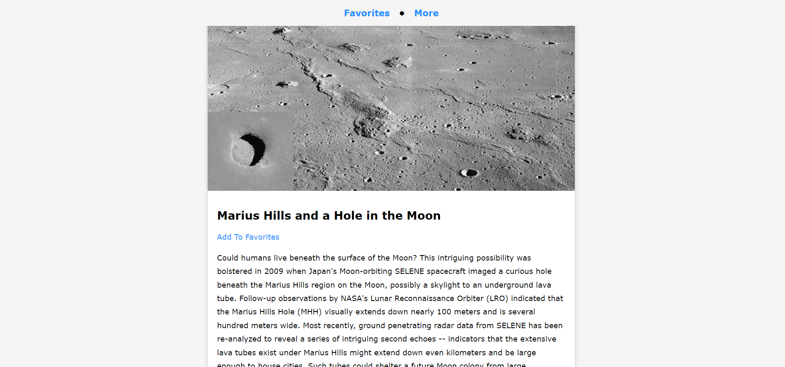

🌌 NASA API Pictures 🌠
This project fetches images from NASA's Astronomy Picture of the Day (APOD) API and displays them on a web page. Users can view the images, add their favorites to a list, and switch between viewing all images and their favorite images.

You can see project [here]((https://lambrugeorge.github.io/NASA-APOD/)).
Usage 🚀
Upon loading the page, 10 random images from NASA's APOD API will be displayed.
Click "More" to fetch and display another set of images.
Click "Add To Favorites" below any image to save it to your list of favorites.
Click "Favorites" in the navigation to view your saved favorite images.
To remove an image from favorites, click "Remove Favorite" below the image in the favorites view.
Features ✨
🌠 Fetches 10 random images from NASA's APOD API.
📸 Displays images with their title, description, and date.
⭐ Allows users to add images to a list of favorites.
🔄 Users can toggle between viewing all images and their favorites.
💾 Favorites are saved in localStorage so they persist between page reloads.
Technologies Used 🛠️
🖥️ HTML5
🎨 CSS3
⚙️ JavaScript (ES6)
🚀 NASA APOD API
